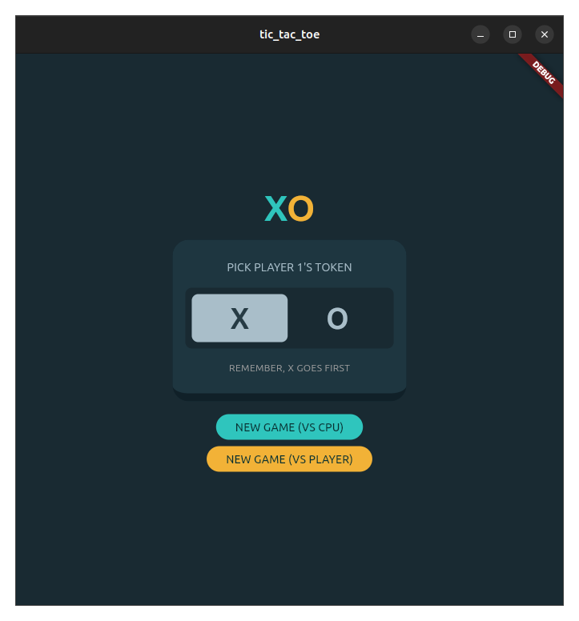
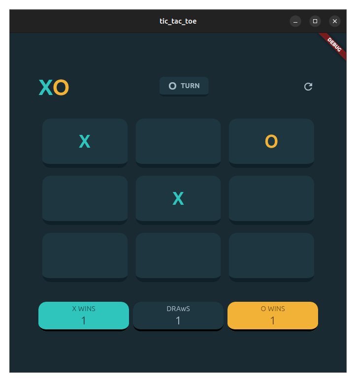
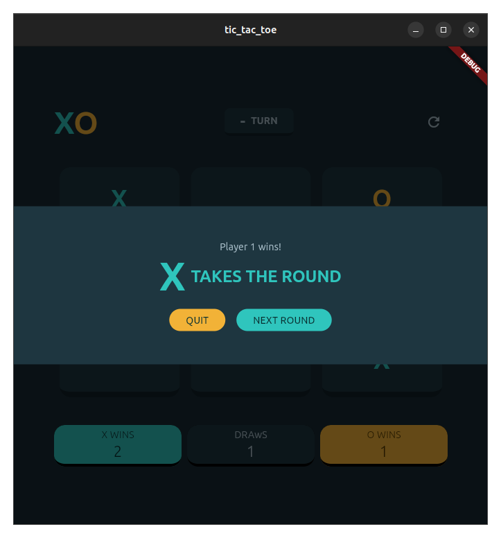
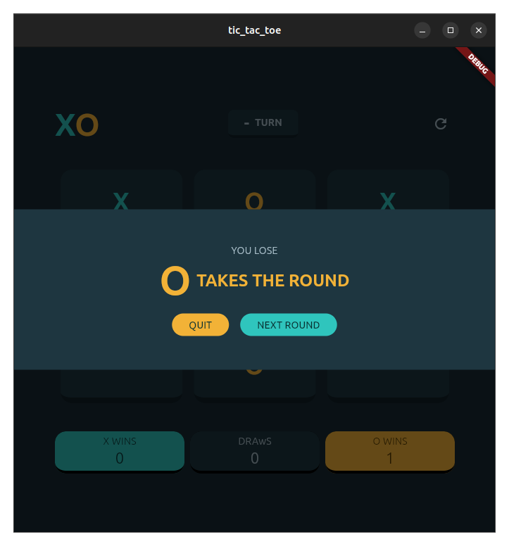
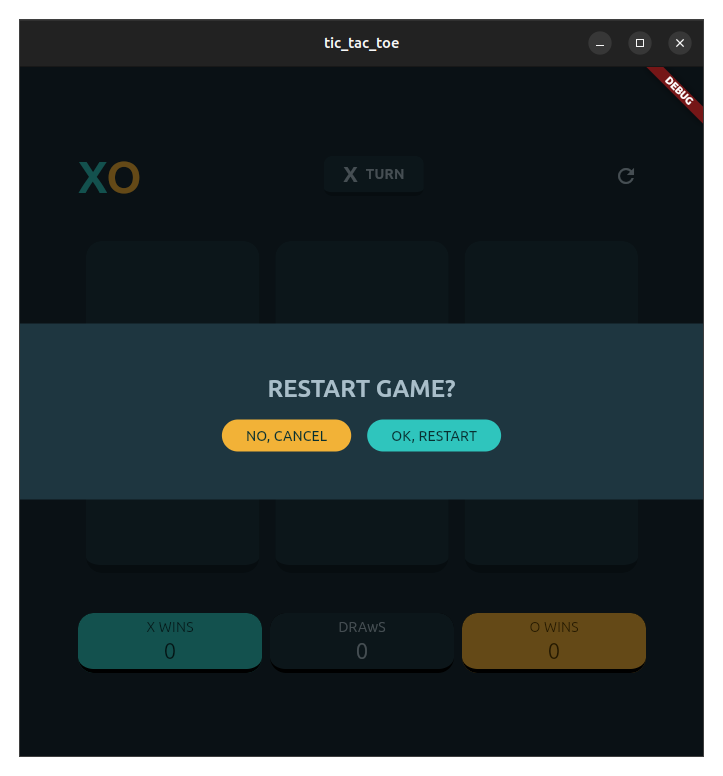
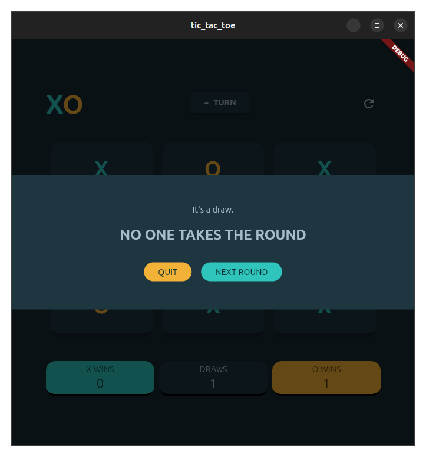

# Tic-Tac-Toe

This is a Tic-Tac-Toe game made Flutter.

## Screenshots

The screenshots are taken while running the application on Linux.

### Mode Selection

### Game

### Modals

## Process

### UI Design

The design of the application was an attempt to replicate that of the [Tic-Tac-Toe Frontend Mentor Callenge](https://www.frontendmentor.io/challenges/tic-tac-toe-game-Re7ZF_E2v). I decided to implement the design just by the screenshots on the challenge page.

### Board representation

The board is represented as a 2D List of BoardTokens (see [lib/board.dart](./lib/board.dart)). The methods modify the board in-place.

The CPU is done using the minimax algorithm. Since Tic-Tac-Toe is a simple game with around 9! (362,880) possible states, which is relatively few for a computer to go through, the CPU is impossible to beat. You can either draw with it or lose.

### State management

State management is done using Flutter Stateful widgets only. Since my goal with this project was to understand how Flutter works conceptually, I leaned more towards a solution provided by the Flutter framework itself. The state being managed is not only for the game logic, but also for the simple animations I have in this project.

## Useful Resources

- [Understanding constraints](https://docs.flutter.dev/ui/layout/constraints) - A very insightful article that helped me understand Flutter layout better
- [How to implement the animated visibility widget](https://canopas.com/how-to-implement-the-animatedvisibility-widget-in-flutter-701b92643bf2) - This article (aside from giving me [Jetpack Compose]() nostalgia) provided ways to manage animation state and encouraged me to explore Flutter's widget lifecycle methods.
- [Flutter Documentation](https://docs.flutter.dev/)
- [Artificial Intelligence: A Modern Approach, 4th US ed.](https://aima.cs.berkeley.edu/) - The chapter on Adversarial Search and Games was a good refresher of the minimax algorithm. (I did not use alpha-beta pruning though)
